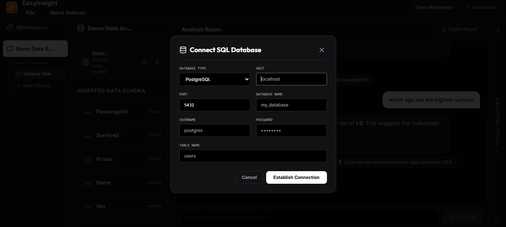

# 📊 EasyInsight

> AI-powered data analysis platform that transforms datasets and databases into actionable insights using natural language.

**EasyInsight** enables users to upload datasets, connect SQL databases, ask questions in plain English, and automatically generate analyses, visualizations, and executable code in a secure sandbox environment.

🌐 **Live Demo:** https://data-analysis-agent-one.vercel.app

---

## ✨ Features

### 🧠 Natural Language Data Analysis

Ask questions about your data in plain English and receive:

* Statistical insights
* Automated summaries
* Data-driven explanations
* Interactive visualizations

### 📂 Multi-Source Data Ingestion

Import and analyze data from:

* CSV files
* JSON files
* Excel spreadsheets
* PostgreSQL databases
* MySQL databases

### 🤖 AI-Powered Analytics Engine

Leverages Large Language Models to:

* Generate analytical Python code
* Perform statistical analysis
* Answer complex data questions
* Explain findings conversationally

### 📈 Automatic Visualization Generation

Generate charts and visual insights automatically using:

* Pandas
* Matplotlib
* NumPy
* Statistical profiling tools

Charts are securely generated, stored, and served with dynamic signed URL resolution.

### 🔒 Secure Sandbox Execution

All generated code executes inside an isolated Docker sandbox environment with strict resource controls and security policies.

### 🛡️ Static Code Validation

Every generated script undergoes security checks before execution:

* Import validation
* Attribute inspection
* Function call analysis
* Policy-based restrictions

### 🗂️ Workspace Isolation

Organize analyses into dedicated workspaces containing:

* Datasets
* Chat sessions
* Message history
* Generated reports
* Visual analytics

### ⚡ Intelligent Model Fallback

Automatically switches between available LLM models when rate limits are encountered, ensuring uninterrupted analysis.

---

## 🏗️ Architecture

```text
┌─────────────────────────┐
│     React Frontend      │
│ TypeScript + Vite + TS  │
└───────────┬─────────────┘
            │
            ▼
┌─────────────────────────┐
│      FastAPI Server     │
│      Python 3.11        │
└───────┬────────┬────────┘
        │        │
        ▼        ▼
      Groq    Supabase
      LLM      Storage
        │
        ▼
     DuckDB Engine
        │
        ▼
  Docker Sandbox Runtime
```

---

## 📸 Screenshots

### Workspace Management

Create isolated workspaces and instantly explore the built-in demo environment.


### Interactive Analysis Room

Explore ingested datasets, inspect schemas, and ask questions naturally.


### Natural Language Analytics

Ask complex questions such as:

* Which age has the highest survival rate?
* Compare survival rates by sex.
* Show the average fare paid by passenger class.

EasyInsight automatically generates code, executes analysis securely, and presents the results in natural language.


### SQL Database Connectivity

Connect directly to external databases and analyze live data.

Supported databases:

* PostgreSQL
* MySQL



---

## 🛠️ Tech Stack

### Frontend

* React
* TypeScript
* Vite
* Tailwind CSS

### Backend

* FastAPI
* Python 3.11
* Groq API (Llama Models)
* Supabase
* DuckDB
* Docker

### Data & Analytics

* Pandas
* Matplotlib
* NumPy
* SQLAlchemy
* OpenPyXL
* Database connectors and profiling libraries

---

## 📂 Project Structure

```text
EasyInsight/
├── backend/              # FastAPI server and analysis engine
├── frontend/             # React + TypeScript application
├── docker_sandbox/       # Secure code execution environment
├── cli_prototype/        # Experimental command-line interface
├── supabase/             # Database configurations and migrations
├── README.md
├── workspace-selection.png
├── analysis-room.png
├── analytics-results.png
└── sql-connect.png
```

---

## ⚙️ Prerequisites

* Python 3.11+
* Node.js 18+
* Docker (recommended for secure sandbox execution)

---

# 🚀 Getting Started

## 1. Clone the Repository

```bash
git clone <repository-url>
cd EasyInsight
```

## 2. Backend Setup

Navigate to the backend directory:

```bash
cd backend
```

Create and activate a virtual environment:

```bash
python -m venv venv

# Linux/macOS
source venv/bin/activate

# Windows
venv\Scripts\activate
```

Install dependencies:

```bash
pip install -r requirements.txt
```

Create a `.env` file:

```env
GROQ_API_KEY=your_groq_api_key
SUPABASE_URL=your_supabase_url
SUPABASE_KEY=your_supabase_anon_key
REQUIRE_DOCKER=false
```

Start the backend server:

```bash
uvicorn app.main:app --reload --port 8000
```

## 3. Frontend Setup

Navigate to the frontend directory:

```bash
cd frontend
npm install
```

Create a `.env` file:

```env
VITE_API_BASE=http://localhost:8000/api
```

Start the development server:

```bash
npm run dev
```

---

## 🐳 Deployment

EasyInsight is configured to run on Hugging Face Spaces using Docker.

### Environment Variables

```env
GROQ_API_KEY=
SUPABASE_URL=
SUPABASE_KEY=
REQUIRE_DOCKER=true
```

Frontend production environment:

```env
VITE_API_BASE=https://<username>-<space-name>.hf.space/api
```

Ensure the Docker container exposes port `7860`.

---

## 🔄 Typical Workflow

1. Create or open a workspace.
2. Upload datasets or connect a SQL database.
3. Ask questions in natural language.
4. Generate Python code automatically.
5. Execute code securely inside Docker.
6. Receive insights, statistics, and visualizations.
7. Export reports and continue analysis sessions.

---

## 🤝 Contributing

1. Fork the repository.
2. Create a branch:

```bash
git checkout -b feature-name
```

3. Commit your changes:

```bash
git commit -m "Add feature"
```

4. Push your branch:

```bash
git push origin feature-name
```

5. Open a Pull Request.

---

> **EasyInsight empowers anyone to explore data conversationally—turning datasets and databases into insights through AI-powered analytics, secure code execution, and automated visualizations.**

---

title: EasyInsight
emoji: 📊
colorFrom: blue
colorTo: green
sdk: docker
pinned: false
-------------
